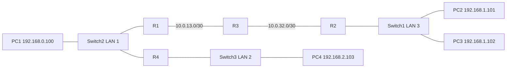
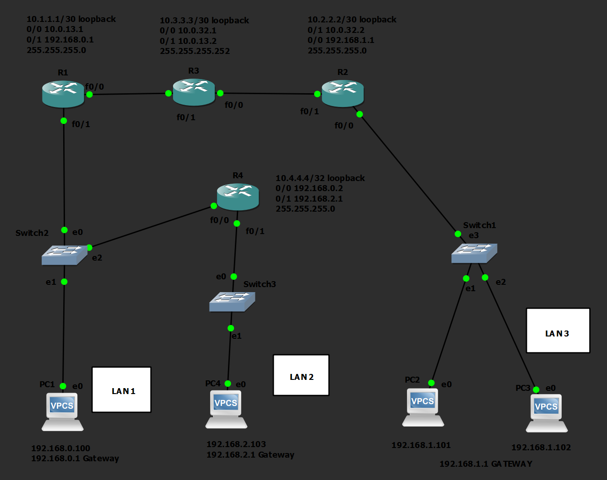
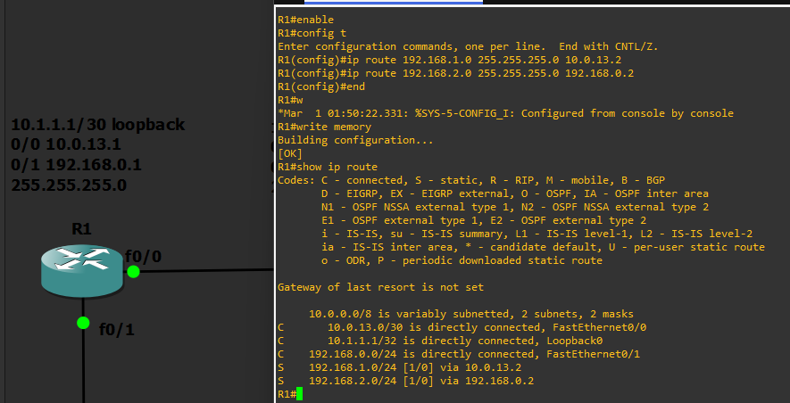
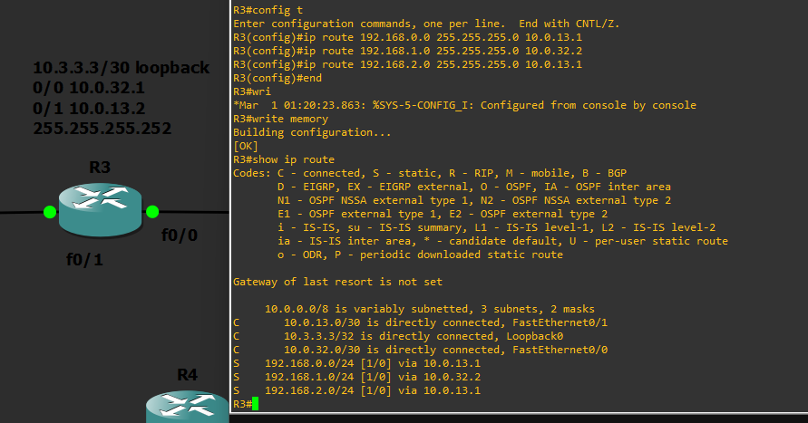
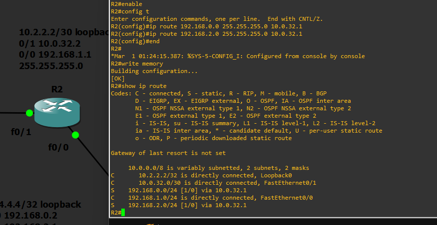
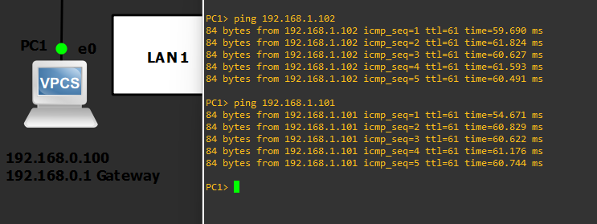
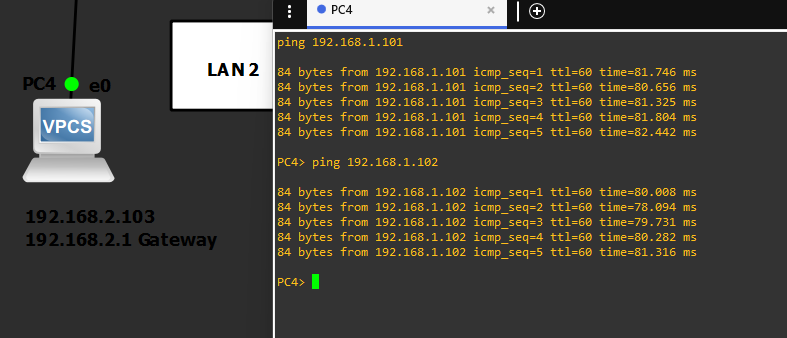
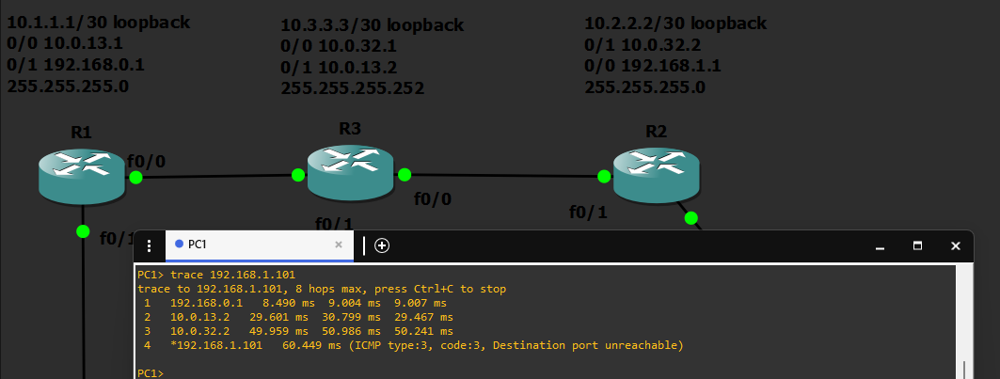
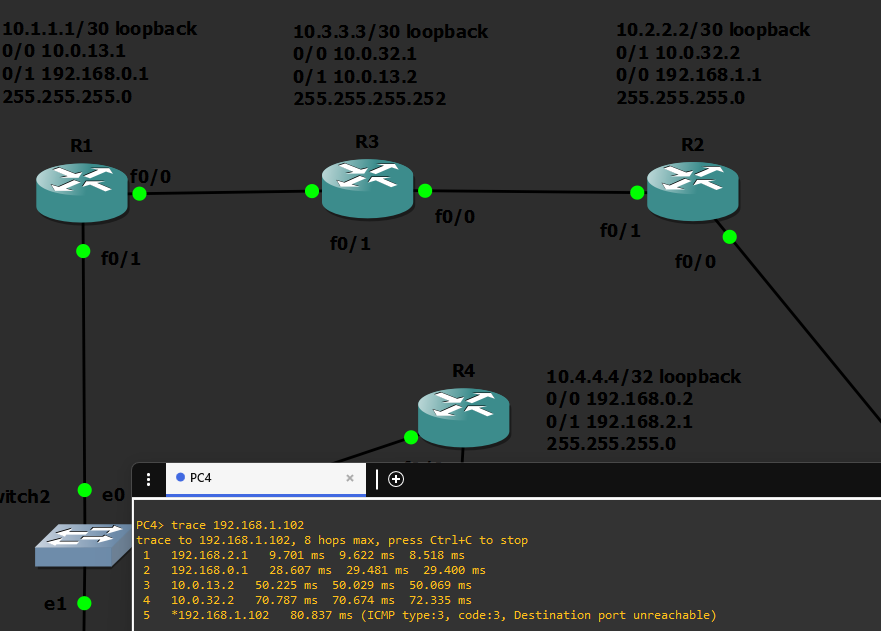

# Four-router static routing

This lab connects three /24 LANs through four routers. The original evidence
shows successful pings from PC1 and PC4 to PC2 and PC3, plus the intermediate hops
in VPCS trace output. Return routes are necessary for the replies to reach the sender.

## Topology



| Router | Fa0/0 | Fa0/1 | Loopback0 |
|---|---|---|---|
| R1 | 10.0.13.1/30 | 192.168.0.1/24 | 10.1.1.1/32 |
| R2 | 192.168.1.1/24 | 10.0.32.2/30 | 10.2.2.2/32 |
| R3 | 10.0.32.1/30 | 10.0.13.2/30 | 10.3.3.3/32 |
| R4 | 192.168.0.2/24 | 192.168.2.1/24 | 10.4.4.4/32 |

LAN 1 is 192.168.0.0/24, LAN 2 is 192.168.2.0/24, and LAN 3 is
192.168.1.0/24. This naming matches the original diagram, even though the
subnet numbers are not in LAN-number order.

## Static routes

| Router | Destination | Next hop |
|---|---|---|
| R1 | 192.168.1.0/24 | 10.0.13.2 |
| R1 | 192.168.2.0/24 | 192.168.0.2 |
| R2 | 192.168.0.0/24 | 10.0.32.1 |
| R2 | 192.168.2.0/24 | 10.0.32.1 |
| R3 | 192.168.0.0/24 | 10.0.13.1 |
| R3 | 192.168.1.0/24 | 10.0.32.2 |
| R3 | 192.168.2.0/24 | 10.0.13.1 |
| R4 | 192.168.1.0/24 | 192.168.0.1 |

Each next hop belongs to a directly connected subnet. Networks directly attached
to a router do not need a static route on that router. Routes to the loopbacks
and all transit-network endpoints are not part of this LAN-to-LAN exercise.

## Open the project

1. Install/configure GNS3 with Dynamips and VPCS. The source project records GNS3 2.2.58.1.
2. Supply your own appropriately licensed compatible IOS images. The saved project
   references `c3660-a3jk9s-mz.124-25d.image` for R1-R3 and
   `c3725-adventerprisek9-mz.124-15.T8.image` for R4.
3. Keep the `gns3` directory intact and open `gns3/static-routing.gns3`.
   Image/template paths may need adjustment to your GNS3 installation.
4. Start the devices, inspect each console, and verify the addressing before testing.
   VPCS startup files now include the addresses shown in the original evidence.

No IOS binaries or appliance disks are included. This is a project-folder export,
not a self-contained portable appliance. Opening it in GNS3 was not tested during preparation.

## Verify in the simulator

On each router:

```text
show ip interface brief
show ip route
```

From PC1 and PC4:

```text
ping 192.168.1.101
ping 192.168.1.102
trace 192.168.1.101
```

Also test the reverse directions when you rerun the lab. The screenshot paths
include PC1 → R1 → R3 → R2 → PC2 and PC4 → R4 → R1 → R3 → R2 → PC3.
The final trace reply says "Destination port unreachable" because the destination
replies to the trace's UDP probe. In these screenshots the final reply comes from
the destination itself; it should not be mistaken for a failed intermediate route.

## Original evidence



The original picture labels three loopbacks as /30. The saved router configs
actually use /32. The project annotations and table above have been corrected;
the historical screenshot remains unchanged.









## Offline check

From the repository root, run `python tools/validate_static_routes.py` with Python 3.12+.
This checks saved addressing, connected next hops, topology consistency, and a
simplified forwarding model for all 12 directed PC pairs. It is not a substitute
for booting the devices and testing actual forwarding.
